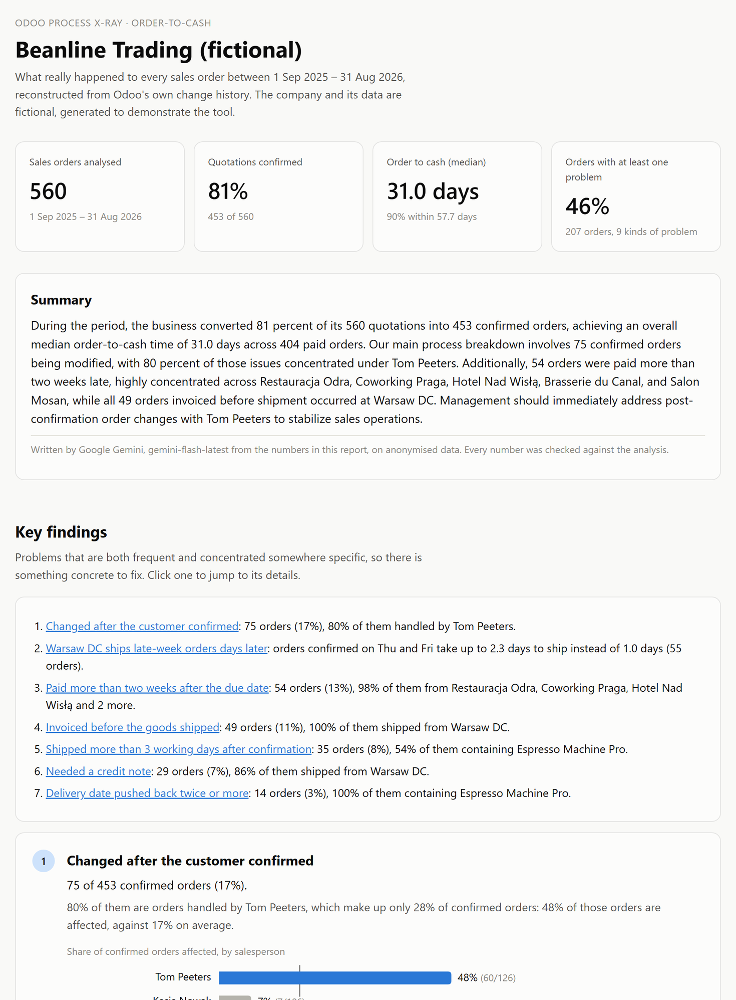
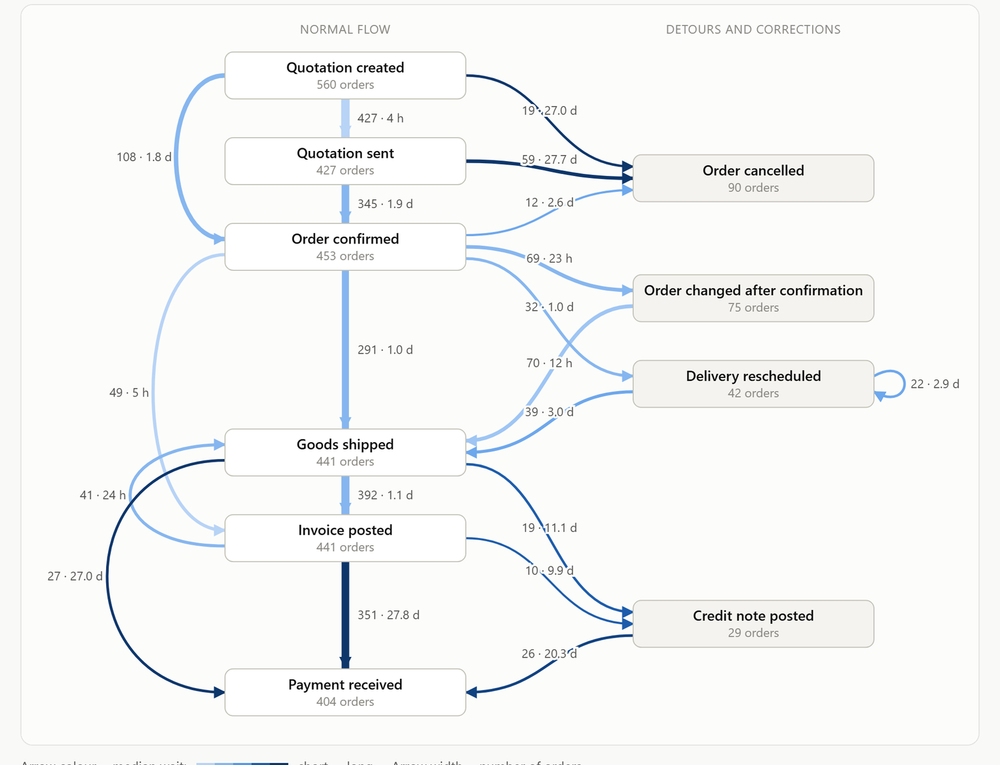
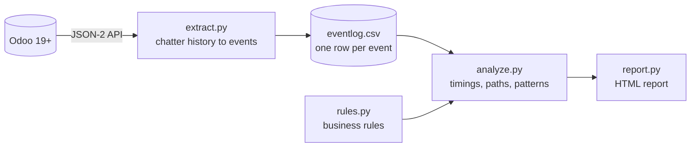

# Odoo Process X-Ray

[](https://github.com/mateuszkrw-coder/odoo-process-xray/actions/workflows/tests.yml)
[](https://github.com/mateuszkrw-coder/odoo-process-xray/actions/workflows/demo.yml)

**Process mining for Odoo.** It reads the change history Odoo already keeps for every sales order,
delivery and invoice, rebuilds how each order really moved from quotation to payment, and shows
where orders get stuck, where the problems concentrate, and which Odoo setting addresses them.

**[→ Open the live demo report](https://mateuszkrw-coder.github.io/odoo-process-xray/)**
(a fictional company with one year of orders, generated in a real Odoo 19)



## Why

Every Odoo database has a timeline for each order hidden in the chatter: *Quotation → Sales Order*,
*Ready → Done*, *Not Paid → Paid*, each with a date and a name. Nobody reads it in bulk. Read in
bulk, it answers the questions a business analyst gets in every project:

- Where do orders wait, and for how long?
- Which orders leave the normal path, and is there a pattern behind it: a person, a warehouse,
  a customer, a product, a weekday?
- What should change in Odoo to fix it?

Consultancies sell this as an audit built on workshops and interviews. This tool does the data part
in a minute, so the workshops can start from facts.

## What it found in the demo

The demo company, *Beanline Trading*, is fictional: a coffee and tea wholesaler with warehouses in
Brussels and Warsaw. Its year of history was generated in a real Odoo 19 with five problems planted
on purpose ([`demo/simulate_company.py`](demo/simulate_company.py)). The analysis is not told about
them. It found all five, and no false patterns:

| Planted in the simulation | What the report says |
|---|---|
| One salesperson edits orders after the customer confirmed | 80% of post-confirmation changes are Tom Peeters' orders: 48% of his orders get changed, against 17% on average |
| Warsaw doesn't pick on Thursday afternoon and Friday | Orders confirmed on Thu/Fri at Warsaw DC take 2.0–2.3 working days to ship instead of 1.0 |
| Warsaw invoices some orders before they ship | All 49 invoiced-before-shipping orders come from Warsaw DC, and so do 86% of credit notes |
| Supplier problems on one product | Every delivery pushed back twice or more contains the Espresso Machine Pro |
| Five customers pay very late | 98% of payments more than two weeks late come from five customers |

Each finding comes with why it matters and what to change in Odoo, for example *Lock Confirmed
Sales*, *Invoicing Policy: Delivered quantities* or *Replenishment* rules.



## How it works



1. **Extract.** Reads sales orders, deliveries, invoices and credit notes, plus their tracked status
   changes (`mail.message` / `mail.tracking.value`), through Odoo's JSON-2 API. The old XML-RPC API
   is deprecated since Odoo 19. The chatter stores status *labels* in the language of whoever made
   the change, so the extractor maps them back to technical values in every installed language
   (the test suite checks this with Polish labels). Read-only: it never writes to Odoo.
2. **Event log.** One row per event: order, activity, timestamp, who, plus order attributes. This is
   the standard process mining format, so the CSV also opens in Disco, Celonis, ProM or PM4Py.
3. **Rules.** Each problem is a short, readable Python function in [`xray/rules.py`](xray/rules.py).
4. **Patterns.** For every rule, the analysis looks for a salesperson, warehouse, customer, product
   or weekday where it happens far more often than elsewhere. A pattern is only reported when it is
   very unlikely to be chance (binomial test, corrected for picking the best-looking group), so
   small numbers don't produce stories.
5. **Report.** One self-contained HTML file: key findings, process map, time per step, shipping
   speed by weekday, most common paths. Works in light and dark mode, and values are always written
   out, never shown by colour alone.

Every number comes from counting and date arithmetic, so the same data always gives the same numbers.

## Optional: an AI-written summary

With `--ai`, a language model writes the opening paragraph — and only the paragraph:

- **Python computes every number.** The model receives the finished analysis as JSON and turns it into
  sentences. It is explicitly forbidden to calculate anything.
- **Its arithmetic is checked.** Every number in the generated text must exist in the analysis. If the
  model invents one, the text is thrown away and the report is published without it. That check has
  its own test.
- **Names stay home.** People and customers are replaced by placeholders (*Salesperson A*,
  *Customer 7*) before the request leaves the machine, and restored in the final text. Use
  `--ai-send-names` if you would rather send the real ones.
- **It is free and optional.** Without a key nothing changes. Works with the Google Gemini and Groq
  free tiers, or any OpenAI-compatible endpoint (`XRAY_AI_URL` + `XRAY_AI_KEY`).
- **Providers change, so nothing depends on one.** Each provider carries a list of candidate models
  and moves on when one is retired. This project learned that the hard way: the first version called
  GitHub Models, which had been retired a few weeks earlier.
- **One caveat worth knowing:** Google's free tier may use prompts to improve their models. That is
  why anonymisation is the default, and why real client data belongs on an endpoint that does not
  train on your input.

```bash
python -m xray report examples/beanline_eventlog.csv --out report.html --ai auto
```

The published demo report shows the summary when an API key is set in the repository's secrets, and
is published without it otherwise.

## Try it

**On the sample data** (no Odoo needed):

```bash
pip install -e .
python -m xray report examples/beanline_eventlog.csv --out report.html --as-of 2026-08-31T21:00:00
```

**On your own Odoo** (version 19 or later):

1. In Odoo, create an API key: *Preferences → Account Security → New API Key*. Use a user with the
   *Settings* access right: reading the change history directly requires administrator rights.
2. Run:

```bash
export ODOO_API_KEY=your-key
python -m xray run --url https://yourcompany.odoo.com --db yourcompany --out-dir output
```

On Odoo Online the external API requires the *Custom* pricing plan.

**Rebuild the whole demo** (needs Docker, about 4 minutes):

```bash
bash demo/build_demo.sh
```

This starts Odoo 19 Community, replays one simulated year (about 3,500 actions: quotations,
confirmations, deliveries, invoices, credit notes, payments) with Odoo's clock moved back so every
date is historical, and creates an API key. GitHub Actions runs the same pipeline on every push and
publishes the report ([`.github/workflows/demo.yml`](.github/workflows/demo.yml)).

## Write your own rule

```python
@rule(
    title="Invoiced before the goods shipped",
    why="Invoicing what hasn't shipped yet leads to disputes and credit notes.",
    odoo_fix="Set the Invoicing Policy to 'Delivered quantities'.",
    applies_to=lambda case: case.has(INVOICE_POSTED) and case.has(GOODS_SHIPPED),
    applies_to_label="invoiced and shipped orders",
)
def invoiced_before_shipping(case):
    return case.happened_before(INVOICE_POSTED, GOODS_SHIPPED)
```

The report picks up new rules automatically, including the search for where they concentrate.

## Project layout

```
xray/
  odoo_api.py    JSON-2 API client
  extract.py     Odoo change history -> event log
  eventlog.py    event log format, and the Case helper rules are written with
  rules.py       the business rules (start here)
  analyze.py     timings, process map, paths, patterns
  ai.py          optional AI summary, with the number check
  report.py      the HTML report
demo/            Odoo 19 in Docker and the one-year simulation
examples/        the demo's event log, ready to analyse
tests/           pytest suite, runs on every push
```

## Limits

- Order-to-cash only, one case per sales order. An invoice that covers several orders counts once
  for each of them.
- Orders migrated from an older system have no change history. The tool then falls back on the
  documents' own dates and the report says how much of the data came from each source.
- The data shows *what* happened, not *why*. Every finding is a question to take to the people
  involved.
- Needs Odoo 19 or later (JSON-2 API).

## Roadmap

- Purchase-to-pay: request for quotation → approval → receipt → vendor bill → payment
- OCEL 2.0 export (object-centric process mining: one order, several deliveries and invoices)
- Ask questions about the process in plain language, answered from the computed numbers

---

Built by [mateuszkrw-coder](https://github.com/mateuszkrw-coder). MIT licensed.
